# whaleshrk patch manager

Infrastructure-as-code for my band whaleshrk.

This platform lets me compile, maintain, and version control my live synth setup as code. The rig is deterministic and full reproducable offline.

I use the ORHACK plugin for the organelle S2 synth. This lets me chain together community instrument & effect modules with a simple user-facing config, with up to 4 parallel chains, 2 sends, and 2 master effects per song.

### Input Types
Each chain can process line input, audio samples, midi note data, or use the device's keyboard. I can also map midi CC control for all parameters. Midi PC messages select a specific song's suite of chains.   

### Synchronisation
The system has bidirectional sync over the mounted SD card (USB mass storage). The module's source of truth is compiled and pushed to the device, recovering safely from interruptions. Pulls turn manual on-device changes into auto-generated PRs.

### Validation
The automated validation suite covers configuration regressions, module integrity and on-device performance benchmarking.

### Workflow
The only user facing workflow is editing the song files in `songs/`. The underlying code handles compilation, card sync, module maintainance, validation, diff and drift detection.

### Song Schema
Each song is declarative YAML: a MIDI program selects the song, named chains define their input and ordered modules, and module parameters use readable catalog names rather than device IDs.

```yaml
song: Sample
program: 1 # Midi PC Number
sends:
  reverb:
    module: plateverb@orhack
    amount: 20
chains:
  - name: guitar
    input: {guitar: true}
    mix: {input-gain: 100, output-gain: 90}
    modules:
      - warp@orhack:
          drive-a: 45
          drive-b: 45
          midi: {drive-a: 71}
          send: {reverb: 20}
      - spiraldelay@orhack: {dry-wet: 25, tempo-sync: 1}
  - name: synth
    input: {guitar: false}
    midi: {channel: 2}
    modules:
      - rings@orhack:
          structure: 45
          midi: {structure: 74}
          note-thru: true
      - warp@orhack: {drive: 30}
```

## Architecture

```mermaid
%%{init: {"theme": "base", "themeVariables": {"background": "#ede4fb"}}}%%
flowchart TD

subgraph group_authoring["Song Authoring"]
  node_song_files["Song Files"]
  node_cli["Rig CLI<br/>[cli.py]"]
  node_song_parser["Song Parser<br/>[parser.py]"]
  node_song_model["Song Model<br/>[model.py]"]
  node_song_validator["Song Validator<br/>[validate.py]"]
end

subgraph group_catalog["Module Catalog"]
  node_catalog_ingest["Catalog Ingest<br/>[ingest.py]"]
  node_catalog_gate["Catalog Gate<br/>[gate.py]"]
  node_catalog_store[("Catalog Store<br/>[store.py]")]
  node_catalog_discovery["Catalog Discovery<br/>[discovery.py]"]
  node_patchstorage_client["Patchstorage Client<br/>[patchstorage.py]"]
end

subgraph group_compile["Compilation"]
  node_compiler["Song Compiler<br/>[compiler.py]"]
  node_router_compiler["Router Compiler<br/>[router.py]"]
end

subgraph group_sync["Device Sync"]
  node_push_runner["Push Runner<br/>[runner.py]"]
  node_push_plan["Push Planner<br/>[plan.py]"]
  node_push_transaction["Push Transaction<br/>[transact.py]"]
  node_state_store["Sync State<br/>[state.py]"]
  node_transport_usb["USB Transport<br/>[usb.py]"]
  node_pull_runner["Pull Runner<br/>[runner.py]"]
  node_reverse_mapper["Reverse Mapper<br/>[reverse.py]"]
end

node_musician(("Musician"))
node_patchstorage["Patchstorage API"]
node_sd_card[("Mounted SD Card")]

node_musician -->|"edits"| node_song_files
node_cli -->|"parses"| node_song_parser
node_song_parser -->|"builds"| node_song_model
node_cli -->|"validates"| node_song_validator
node_cli -->|"reads"| node_catalog_store
node_cli -->|"dispatches"| node_push_runner
node_cli -->|"dispatches"| node_pull_runner
node_catalog_discovery -.->|"requests"| node_patchstorage_client
node_patchstorage_client -.->|"fetches"| node_patchstorage
node_catalog_ingest -->|"checks"| node_catalog_gate
node_catalog_ingest -->|"writes"| node_catalog_store
node_push_runner -->|"compiles"| node_compiler
node_compiler -->|"builds"| node_router_compiler
node_push_runner -->|"plans"| node_push_plan
node_push_runner -->|"executes"| node_push_transaction
node_push_transaction -->|"writes"| node_transport_usb
node_transport_usb -->|"syncs"| node_sd_card
node_push_runner -->|"records"| node_state_store
node_pull_runner -->|"reads"| node_transport_usb
node_pull_runner -->|"reads"| node_state_store
node_pull_runner -->|"reverse-maps"| node_reverse_mapper
node_pull_runner -->|"rewrites"| node_song_files

click node_cli "https://github.com/dymartin/whaleshrk-patch-manager/blob/main/system/rig/cli.py"
click node_song_parser "https://github.com/dymartin/whaleshrk-patch-manager/blob/main/system/rig/song/parser.py"
click node_song_model "https://github.com/dymartin/whaleshrk-patch-manager/blob/main/system/rig/song/model.py"
click node_song_validator "https://github.com/dymartin/whaleshrk-patch-manager/blob/main/system/rig/song/validate.py"
click node_catalog_ingest "https://github.com/dymartin/whaleshrk-patch-manager/blob/main/system/rig/catalog/ingest.py"
click node_catalog_gate "https://github.com/dymartin/whaleshrk-patch-manager/blob/main/system/rig/catalog/gate.py"
click node_catalog_store "https://github.com/dymartin/whaleshrk-patch-manager/blob/main/system/rig/catalog/store.py"
click node_catalog_discovery "https://github.com/dymartin/whaleshrk-patch-manager/blob/main/system/rig/catalog/discovery.py"
click node_patchstorage_client "https://github.com/dymartin/whaleshrk-patch-manager/blob/main/system/rig/catalog/patchstorage.py"
click node_compiler "https://github.com/dymartin/whaleshrk-patch-manager/blob/main/system/rig/compile/compiler.py"
click node_router_compiler "https://github.com/dymartin/whaleshrk-patch-manager/blob/main/system/rig/compile/router.py"
click node_push_runner "https://github.com/dymartin/whaleshrk-patch-manager/blob/main/system/rig/push/runner.py"
click node_push_plan "https://github.com/dymartin/whaleshrk-patch-manager/blob/main/system/rig/push/plan.py"
click node_push_transaction "https://github.com/dymartin/whaleshrk-patch-manager/blob/main/system/rig/push/transact.py"
click node_state_store "https://github.com/dymartin/whaleshrk-patch-manager/blob/main/system/rig/push/state.py"
click node_transport_usb "https://github.com/dymartin/whaleshrk-patch-manager/blob/main/system/rig/transport/usb.py"
click node_pull_runner "https://github.com/dymartin/whaleshrk-patch-manager/blob/main/system/rig/pull/runner.py"
click node_reverse_mapper "https://github.com/dymartin/whaleshrk-patch-manager/blob/main/system/rig/pull/reverse.py"

classDef toneNeutral fill:#f8fafc,stroke:#334155,stroke-width:1.5px,color:#0f172a
classDef toneBlue fill:#dbeafe,stroke:#2563eb,stroke-width:1.5px,color:#172554
classDef toneAmber fill:#fef3c7,stroke:#d97706,stroke-width:1.5px,color:#78350f
classDef toneMint fill:#dcfce7,stroke:#16a34a,stroke-width:1.5px,color:#14532d
classDef toneRose fill:#ffe4e6,stroke:#e11d48,stroke-width:1.5px,color:#881337
classDef toneIndigo fill:#e0e7ff,stroke:#4f46e5,stroke-width:1.5px,color:#312e81
classDef toneTeal fill:#ccfbf1,stroke:#0f766e,stroke-width:1.5px,color:#134e4a
class node_song_files,node_cli,node_song_parser,node_song_model,node_song_validator toneBlue
class node_catalog_ingest,node_catalog_gate,node_catalog_store,node_catalog_discovery,node_patchstorage_client,node_patchstorage,node_sd_card toneAmber
class node_compiler,node_router_compiler toneMint
class node_push_runner,node_push_plan,node_push_transaction,node_state_store,node_transport_usb,node_pull_runner,node_reverse_mapper toneRose
class node_musician toneIndigo
```



## Running the rig

Requires Python 3.11+ and [uv](https://docs.astral.sh/uv/).

```sh
uv sync
uv run rig --help
```

Common commands:

```sh
uv run rig lint # Validate songs and module archives

uv run rig push --dry-run # Preview rendered changes
uv run rig push # Deploy the rig to the device

uv run rig pull --dry-run # Preview on-device drift
uv run rig pull # Import on-device diff as config
```

Technical notes are in [`system/docs/`](system/docs/README.md).
